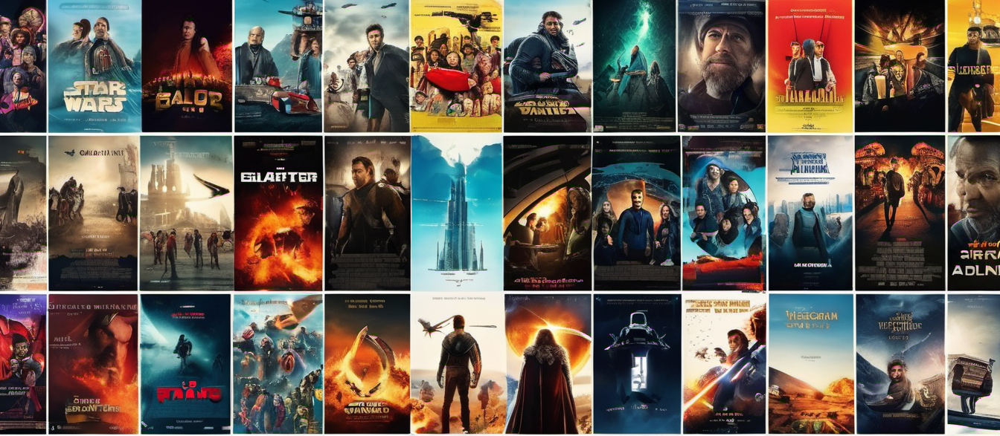

<h1 align="center">Recommendation System Using Vectorization and Cosine Similarity</h1>

## 🚀 About Recommendation Systems:

Many applications like to provide a set of recommendations to users based on their previous tastes. For example, Netflix provides movie recommendations because you watched this and movies similar to previously watched movies. These algorithms analyze users's past behavior and preferences to suggest things they might like, from movies and music to new books and clothes. They're everywhere these days, personalizing users's online experiences and making it easier to discover things they enjoy. In the project a simple version of the same is used vectorizing each movie and then finding the similarity between each movies using cosine similarity metric.

## 🛠️Steps:
- Get the data that has movie names and description of each movie.
- Choose the relevant data that are useful to find the similarity between movies.
- Remove the filler words and perform stemming to handle similar words (like work, working, worked etc ) 
- Find the number of most frequent words and choose a appropriate dimension to convert each movie to vector a.
- Find the similarity of each movie with others and return most similar movies. 

## 📊Results:

## ⚡Technologies and Applications Used:

## 📈Improvements:
